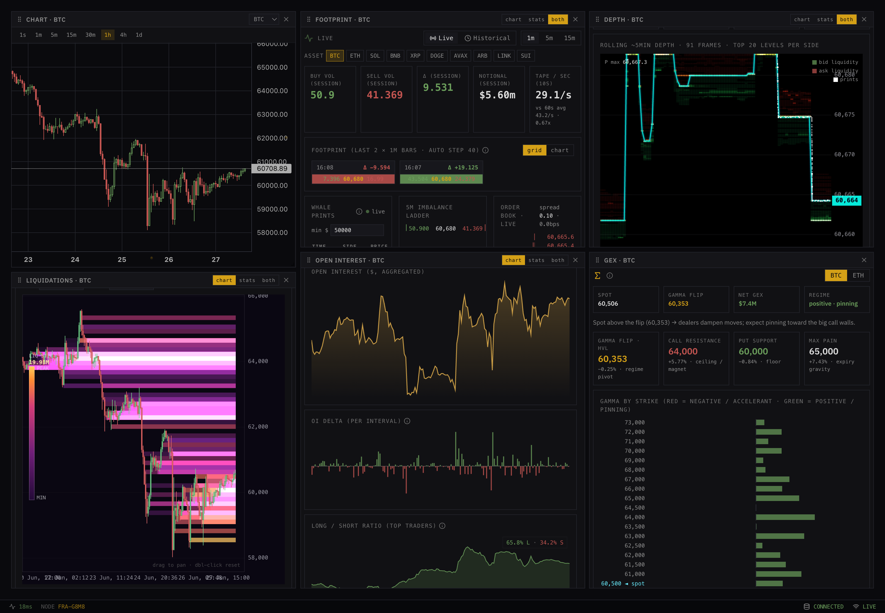
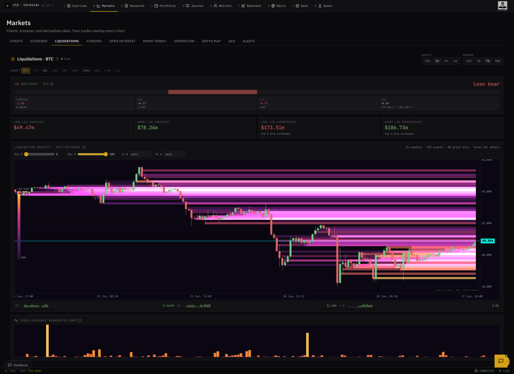
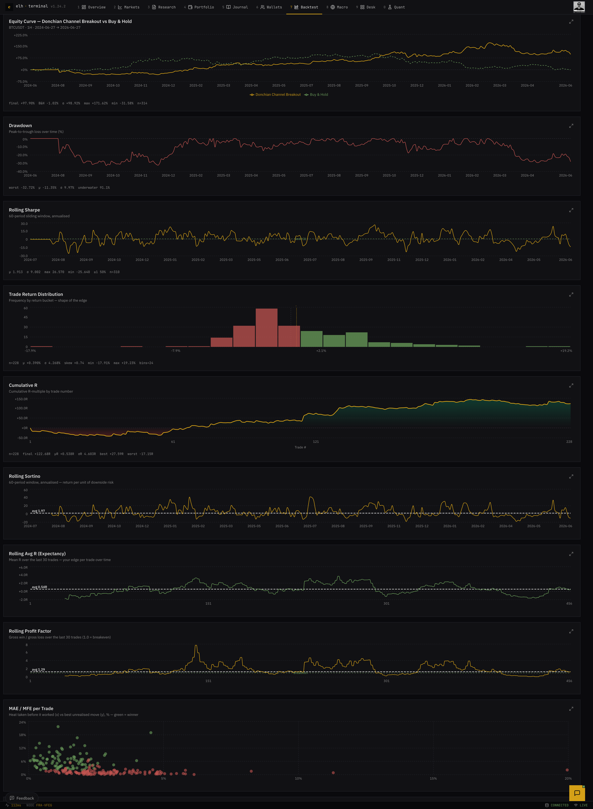
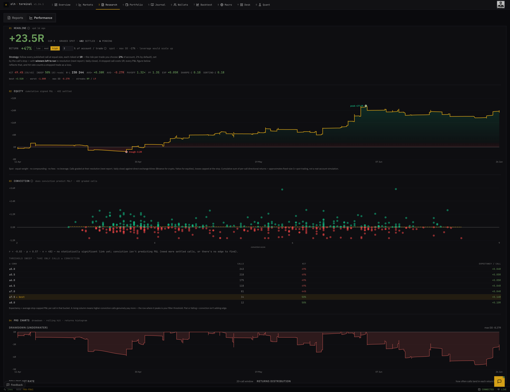
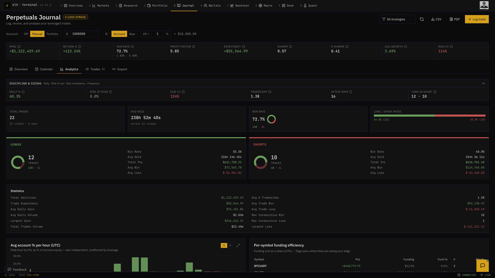
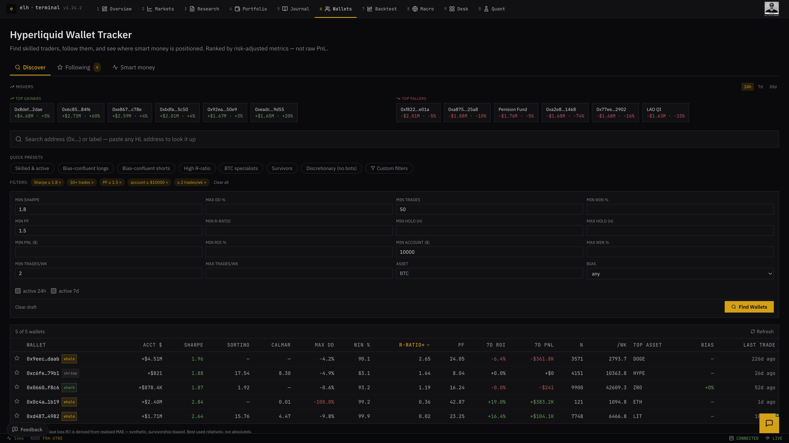

# ELH Terminal

A multi-asset trading terminal I've been building. It's live at **[elhterminal.com](https://elhterminal.com)**.

Most retail traders end up with five tabs open: TradingView for charts, a couple of sites for derivatives and liquidations, something for wallets, and a separate app for journalling. ELH Terminal is my attempt to put that lot behind one login. Live markets, a full derivatives layer, a block-based backtester, a forward-testing paper engine with a verified track record, an on-chain wallet tracker, a perps journal and an AI research desk, all over one per-user data model.

It started as my final-year computer science dissertation at Nottingham Trent University (submitted 2026), and I've kept building it into a real product since.

-336791?style=flat-square)

> The source repo is private. Happy to give recruiters a full walkthrough or a live demo on request.

*The Desk: a composable multi-pane workspace. Here it's running a price chart, order-flow footprint, order-book depth heatmap, liquidation map, open interest and a gamma-exposure panel side by side, each pane independently configurable.*

## What it does

**Markets and derivatives.** Live crypto over Binance websockets and equities/indices over Finnhub, drawn on Lightweight Charts. On top of price sits the derivatives layer most retail tools paywall: funding and open interest, a Coinglass-style liquidation heatmap, a Bookmap-style order-book depth heatmap, on-chart order-flow footprint with stacked imbalances and sweep detection, a gamma-exposure (GEX) panel, anchored VWAPs and liquidation-magnet levels.

**Strategy Lab.** A block-based backtester (more on the architecture below). Around 38 strategies across trend, momentum, mean-reversion, breakout, adaptive, seasonality and ICT families, on any Binance pair or yfinance ticker from 15-minute up to weekly. Walk-forward validation with a configurable fold count and out-of-sample ratio, MAE/MFE, R-multiples, and a full risk metric set. You can also write your own strategy in Python. It runs in the browser under Pyodide and is simulated server-side through the same engine, and a Pine-to-Python transpiler ports a TradingView script into that same sandbox.

**Research desk and verified track record.** Two market briefs a weekday, generated off a TradingView node, signed into the backend over HMAC, rendered to PDF, then graded against price after the fact. The directional track record is auditable rather than just claimed: hit rate, expectancy, cumulative R, a conviction-versus-outcome scatter with a significance test, and an underwater drawdown curve, all in R-multiples against exchange klines. Where the data doesn't support a claim, the app says so (the conviction study below reads "no statistically significant link yet" rather than inventing an edge).

**Paper engine.** Any model from the Strategy Lab can be deployed to a forward-only paper account. A worker trades it bar by bar on live klines, fires entry, exit and flip calls into Discord threads and Telegram, keeps a pinned "open book" of live positions with their unrealised R, and posts daily and weekly track-record summaries. Every deployment passes a ledger-parity gate first: it refuses to go live if the ledger the worker would trade diverges from the ledger its backtest grades were computed on, so the live record measures the same thing the backtest promised.

**Perpetuals journal.** Log trades by hand, import a CSV, or pull them straight from Hyperliquid. Each one is enriched with MAE/MFE against the klines, and you get around 20 statistics (expectancy, profit factor, R-multiples, Sharpe, Kelly, risk of ruin, streaks, size consistency), an hour-of-day heatmap, an excursion scatter, partial closes, per-symbol funding efficiency, and a one-line "biggest leak, strongest edge" read.

**Wallet tracker.** A Hyperliquid leaderboard built off a websocket harvester, with smart-money flow, a follow list, and alerts when a wallet you follow changes position, delivered in-app, over Discord, Telegram or email.

**The Wire.** A real-time news layer over multiple RSS sources and Finnhub, with a deterministic tagger that scores each headline for market importance and topic, plus an honest macro facts strip (net USD liquidity, the broad dollar, real yields, BTC dominance) drawn from FRED and CoinGecko.

**Connections.** Read-only, encrypted API links to Binance, Hyperliquid and Trading 212 that auto-populate the portfolio and journal, so trades aren't entered by hand.

**AI assistant.** A Gemini chat grounded in the current screen and the user's portfolio and journal (balances masked), proxied entirely server-side.

Plus a beginner/pro mode toggle, privacy masking across every panel that shows money, and a PWA build that works on mobile.

## How it's built

| Layer | Stack |
|---|---|
| Backend | Python 3.11, FastAPI, Uvicorn, Pydantic v2, PostgreSQL (Neon), pandas, NumPy |
| Frontend | React 19, TypeScript (strict), Vite, Tailwind, Lightweight Charts, Recharts |
| Real-time | Binance WS (direct), Finnhub WS (proxied), Hyperliquid WS (wallet harvester) |
| AI | Gemini 2.5 Flash, server-side with daily caps and a response cache |
| Hosting | Render (backend, Frankfurt), Neon (database, EU), Vercel (frontend) |

A few things hold across the codebase:

- **Keys stay server-side.** Every third-party API (Binance, Finnhub, FRED, Gemini, Hyperliquid) is called from the backend. The browser only ever receives shaped responses and never holds a secret.
- **Metrics are deterministic.** Scores, backtests and journal statistics are pure functions over stored inputs and reproduce exactly from the database. The same config and the same klines always give the same numbers.
- **Dev mirrors prod.** Local runs against the same Postgres dialect and the same Pydantic contracts that serve production.

### The backtester

The quant engine is a `BaseBlock` pipeline. Each block adds columns to the OHLCV frame in turn:

- **Strategy blocks** are pure entry triggers. They only emit the signal.
- **A bias-filter block** is an optional regime overlay (higher-timeframe trend, market structure, multi-timeframe confluence, liquidity) that masks signals which disagree with context.
- **An exit-policy block** is a strategy-agnostic layer for take-profit, stop, trailing stop, break-even and time-stop, in percent, ATR or structural modes.

Keeping entries, bias and exits as separate composable layers means any strategy can be A/B tested against any exit or regime filter without rewriting it. Exits resolve against each bar's high and low (intrabar, not the close) and pessimise to the stop on a same-bar collision, with trailing and break-even computed off prior-bar extremes to avoid within-bar look-ahead. That is the difference between a backtest that flatters itself and one you can trust.

### The model search

The same search space that composes the Strategy Lab is exposed as an offline crawler. It samples across every strategy block, its parameter space, the composable bias filters, the exit policies, trading sessions and side, then scores each candidate on walk-forward. Overfitting is guarded explicitly: an out-of-sample holdout, generalisation and stability screens, and per-pass deduplication so each pass explores genuinely new configs rather than re-grading survivors. The aim is a deterministic signals engine whose members are robust out-of-sample survivors, gated on criteria fixed before the run and forward-paper-tested before they ever fire.

### Security

JWT in an HttpOnly cookie (unreadable from JS), CSRF double-submit on every mutating request, HMAC-SHA256 on the machine-to-machine report ingest, TOTP 2FA and email verification, `slowapi` rate limits on auth and compute-heavy routes, Pydantic validation at every boundary (regex, `Literal` enums, bounded ranges), and per-user isolation enforced in every query. Over 1,000 backend tests run DB-free against mocked dependencies, with strict TypeScript across the frontend and CI on every PR.

## Quant roadmap

The direction is to turn the discretionary research into a measured, robustness-tested engine:

- **Stochastic price simulation.** GBM and GARCH(1,1) path generation (with Student-t shocks for crypto's fat tails), Monte-Carlo VaR/CVaR via Cholesky-decomposed return covariance, and an Ornstein-Uhlenbeck process for spreads and funding rates.
- **A strategy robustness battery.** Run a strategy across many simulated and bootstrapped paths rather than one historical path, and look at the *distribution* of Sharpe, drawdown and return; permutation tests against shuffled entries; parameter-perturbation stability.
- **A public, per-user leaderboard.** Forward-only virtual accounts tracking each user's deployed models, ranked on a risk-adjusted, sample-gated basis, with a verified track record and private logic.
- **An ML signal filter.** A quarterly-refit meta-model that learns which of the engine's calls to take, once there are enough graded calls to train on honestly.

---

Built by Eden Hendry. Live at [elhterminal.com](https://elhterminal.com).
